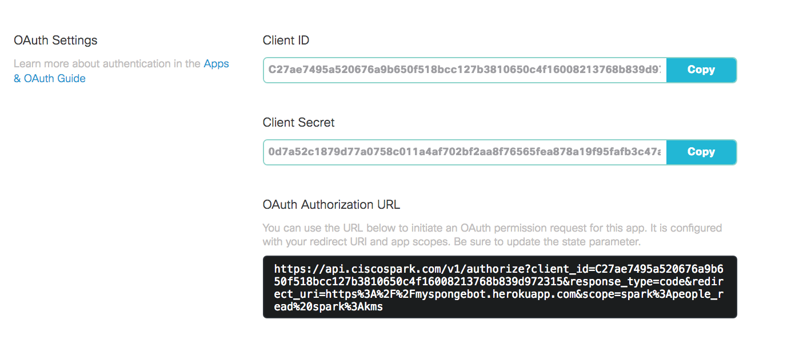
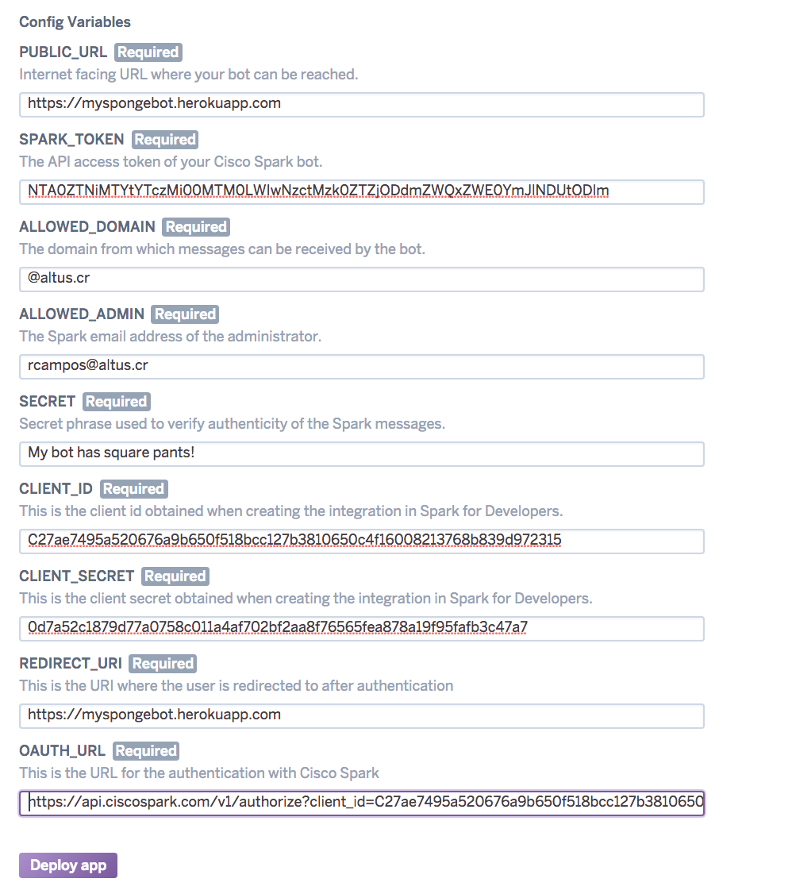
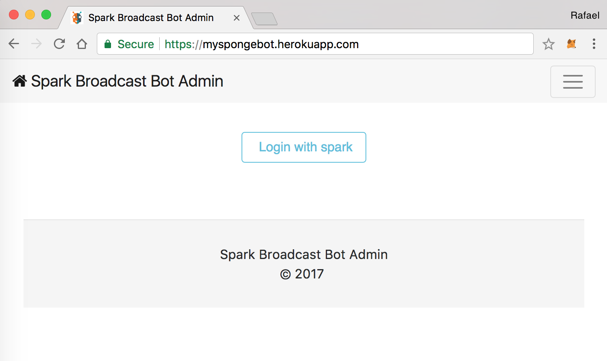
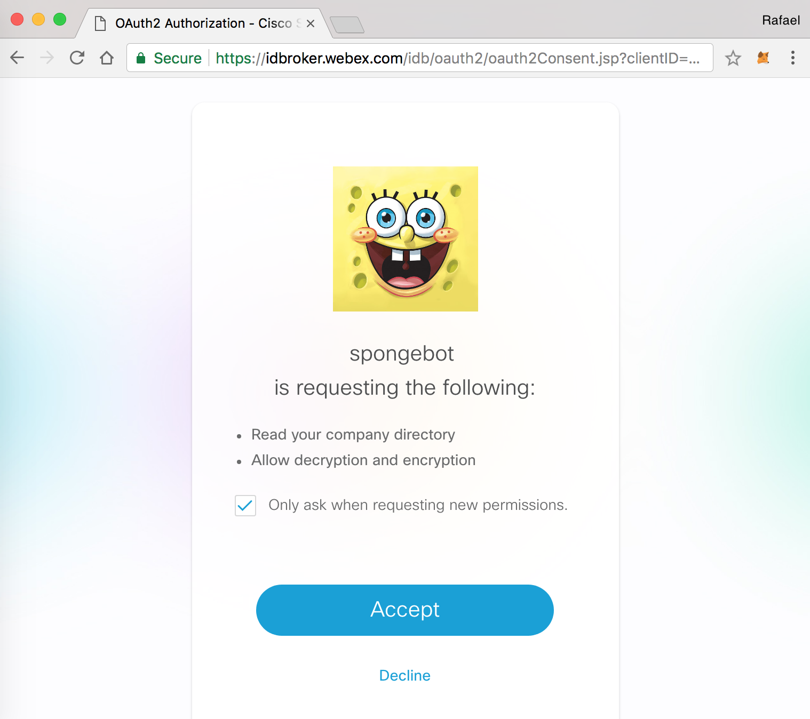
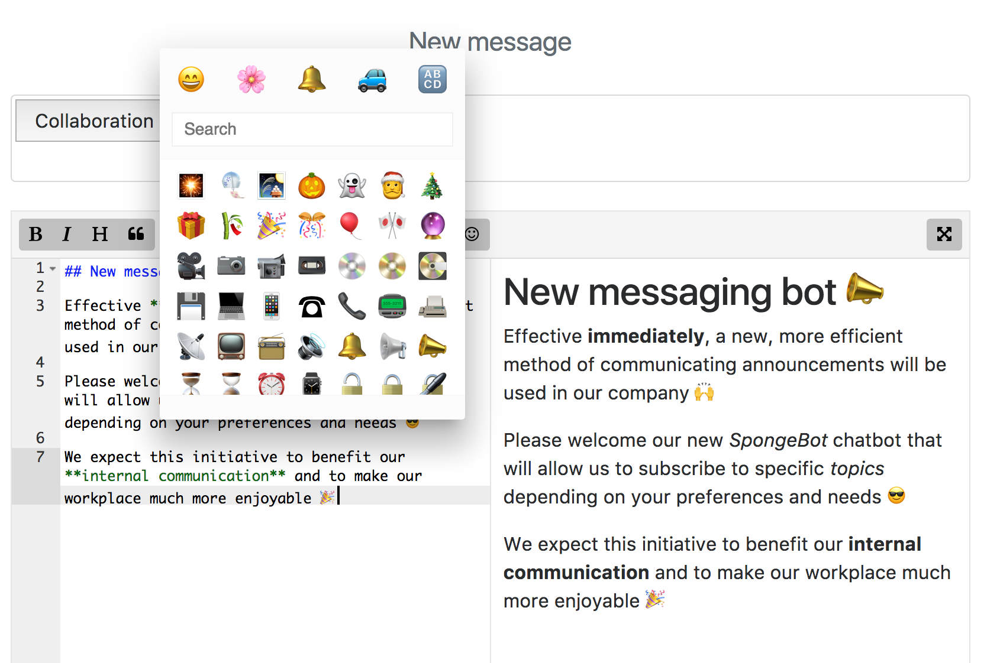
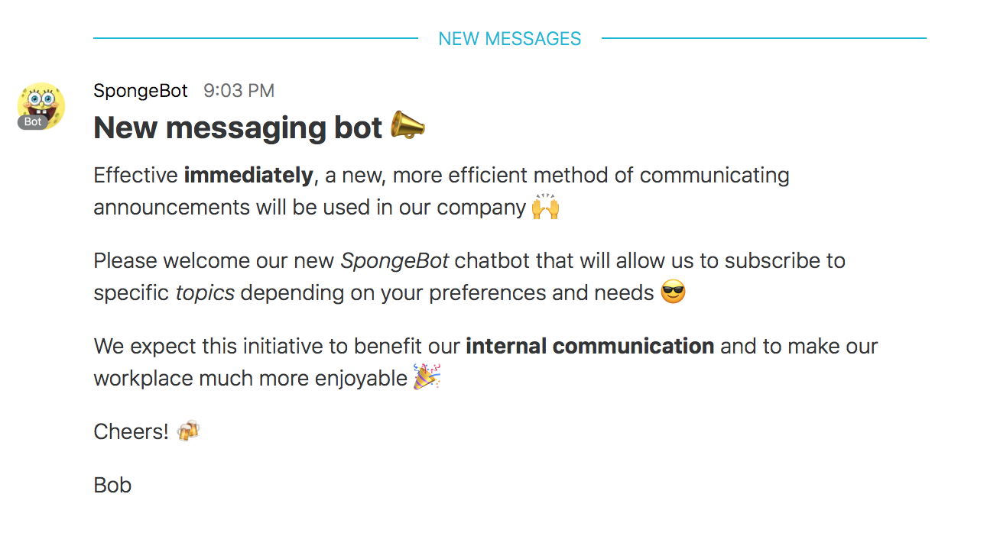
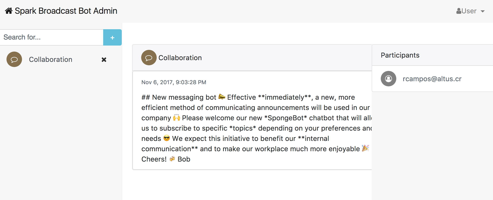
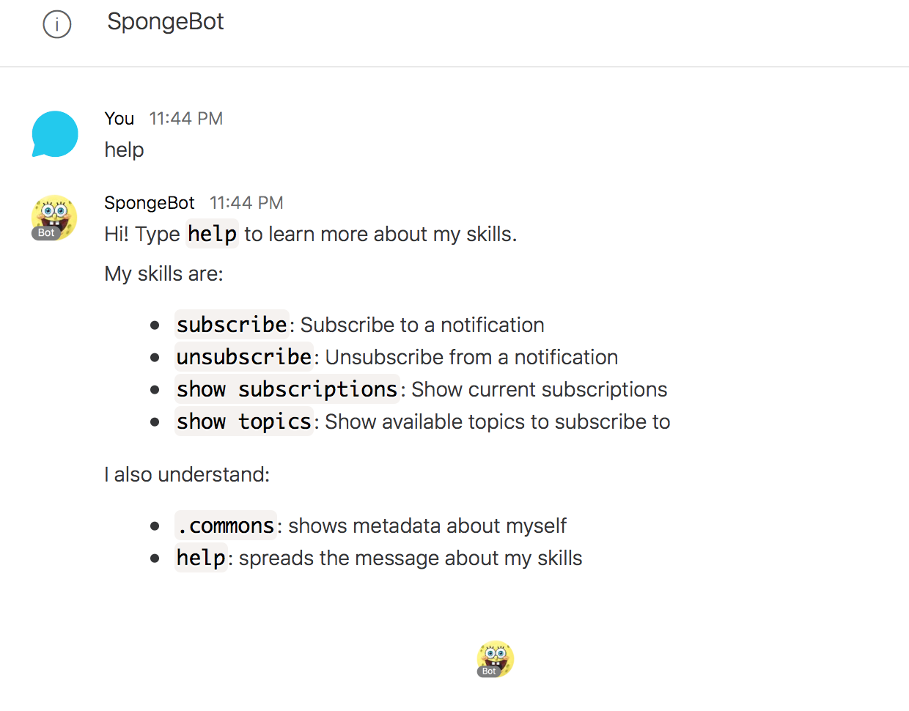
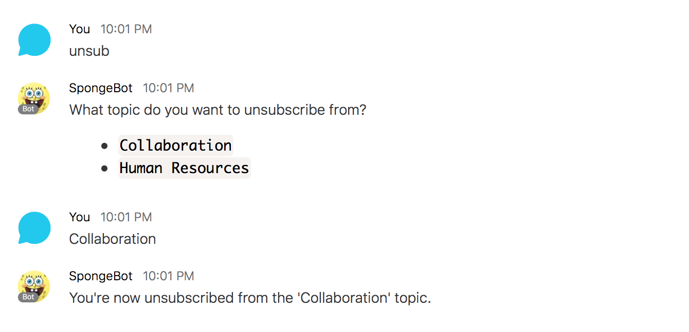

# Spark Broadcast Bot: A Multi-topic Cisco Spark Notification Bot 

Inspired by [BotKit samples for Cisco Spark](https://github.com/CiscoDevNet/botkit-ciscospark-samples) by Stève Sfartz <mailto:stsfartz@cisco.com>

## Instructions for deployment to Heroku

1. Click the **Deploy to Heroku** button below and choose a name for your app. Heroku will tell you right away if it's a valid name or not. Leave this page open because you will come back soon to complete the process.

    

2. Create a Bot Account from the ['Spark for developers' bot creation page](https://developer.ciscospark.com/add-bot.html). 
    - Choose a display name, a valid username and an icon for your bot. 
    - Press the **Add Bot** button and wait for your bot to be created. 
    - Copy your bot's **Access Token**.

3. Create an Integration from the ['Spark for developers' integration creation page](https://developer.ciscospark.com/add-integration.html). 
    - Choose a name, a description, a support email and an icon for your integration. 
    - In the **Redirect URI(s)** box write `https://{app-name}.herokuapp.com`, where `{app-name}` is the name you chose for your Heroku app in step 1.
    - In the **Scopes** section, select `spark:people_read`.
    - Press the **Add Integration** button and wait for your bot to be created.

    

    - Copy the **Client ID**
    - Copy the **Client Secret**
    - Copy the **OAuth Authorization URL**

     

4. Go back to Heroku and scroll down until you reach the **Config Variables** section. Fill them according to the following instructions:
    - **PUBLIC_URL**: Write `https://{app-name}.herokuapp.com` where `{app-name}` is the name of your Heroku app.
    - **SPARK_TOKEN**: The token you got when you created your Spark bot.
    - **ALLOWED_DOMAINS**: A single domain or a commma-separated list of domains you want to restrict the bot to, in the format `mydomain.com` or `mydomain1.com,mydomain2.com`.
    - **ALLOWED_ADMIN**: The Spark username of the person authorized to manage the web application.
    - **SECRET**: Any secret phrase. This is used to validate both Spark's messages to the bot and to generate the authentication tokens used by the app backend.
    - **CLIENT_ID**: The client id you got when creating the integration.
    - **CLIENT_SECRET**: The client secret you got when creating the integration.
    - **REDIRECT_URI**: The URI you specified when creating the integration. It's `https://{app-name}.herokuapp.com` where `{app-name}` is the name of your Heroku app.
    - **OAUTH_URL**: The **OAuth Authorization URL** you got when creating the integration.
    - Click **Deploy app**

    

    Your application will now be created, configured, built and deployed to Heroku. 

    

    After the process is done, your bot should be up and running and the administrator specified in the **ALLOWED_ADMIN** config variable should now be able to log into the management app at `https://{app-name}.herokuapp.com`.

## Logging into the management app

Log into the management app at `https://{app-name}.herokuapp.com` by clicking **Login with Spark**.

- You will be redirected to the Cisco Spark login page where you can input your credentials.

- You will be asked if you want to allow the app to read your company directory and  encrypt and decrypt messages. Click **Accept**.

- You should be redirected back to the app, where you can now manage your notification bot.

## Creating topics and sending messages

Messages are sent to specific topics, so you can't send any messages before at least one topic exists.

1. Click the **+** button and type a name for your topic. Then press **Send**.

On the left pane, the new topic should appear below the search box.

2. Now that we have a topic we can send a message. Return to the home screen by clicking **Spark Broadcast Bot Admin** in the upper left side of the pane.

    - Select the topic from the dropdown list.

    

    - Write your message in the text editor provided. Please notice that you can take advantage of the [Markdown markup language](https://guides.github.com/features/mastering-markdown/) to format your message and make it more pleasant to read. You can even use emojis :wink:!

    

    - When you're done writing you message, press **Send** to deliver the message to all subscribers.

    

    - All people subscribed to this topic will receive your message.

    

## Topic properties

To access the topic properties click on the name of the topic you want to check. You should see the list of messages sent to that specific topic, as well as a list of subscribers to that topic.

## Interacting with the bot

To begin interacting with the bot you need to add it to your Cisco Spark account as a contact.

Once its added, you can begin by saying `help` to the bot to see all the commands it understands.

Here is a summary of the commands, their shorthand and what each does:

| Command | Shorthand | Action |
|---|---|---|
| `show topics` | N/A | show available topics |
| `subscribe` | `sub` | subscribe to a topic | 
| `unsubscribe` | `unsub` | unsubscribe from a topic | 
| `show subscriptions` | `show sub` | show current subscriptions |

Let's see a typical interaction with the bot

- First, let's ask for all the available topics and for our current subscriptions:

- Then, let's subscribe to the Human Resources topic:

- Finally, let's unsubscribe from a topic:

